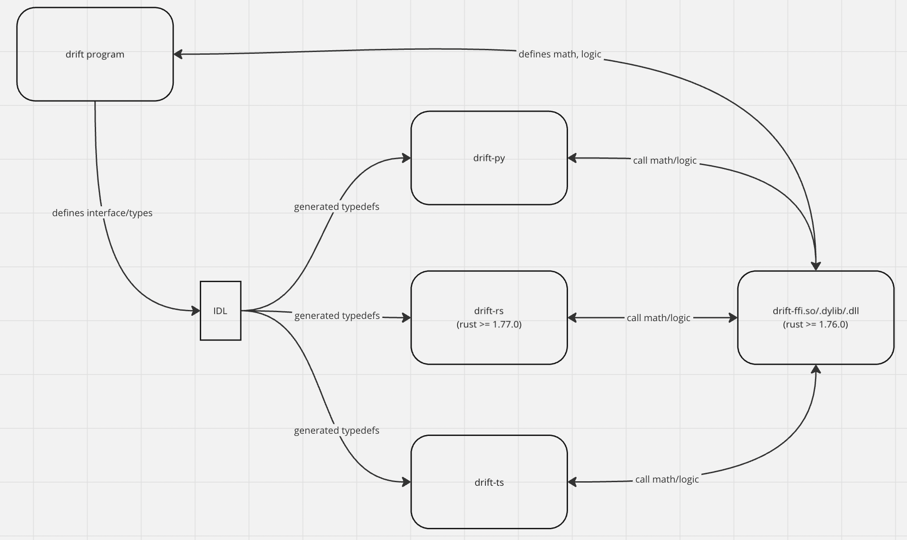

# drift-ffi

Exposes C-ABI bindings for drift program.

Goals:
1) Enable building SDKs that reuse program logic.  
2) Separate rust SDK from program/solana runtime dependencies. Allows rust SDK to freely update to latest solana-* crates with bug fixes, improvements, etc.



## Installation

### Prebuilt

Download latest [release libs](https://github.com/drift-labs/drift-ffi-sys/releases), unzip and link/copy to `/usr/lib` (linux) or `/usr/local/lib` (mac)

### from Source
```shell
rustup install 1.76.0-x86_64-apple-darwin # M1 mac
rustup install 1.76.0-x86_64-unknown-linux-gnu # linux

cargo build --release
ln -sf ./target/release/libdrift_ffi_sys.dylib /usr/local/lib # mac
ln -sf ./target/release/libdrift_ffi_sys.so /usr/lib #linux
``` 

## Developer Notes
- this crate must be built with rust <= 1.76.0 to provide compatibility with onchain data layouts (later rust versions have breaking changes [128-bit integer C-abi compatibility](https://blog.rust-lang.org/2024/03/30/i128-layout-update.html))

- for rust users this crate is intended to be linked via compiler flags (not Cargo dependency) as it compiles to a (platform dependent) dynamic lib (`.so/.dylib/.dll`)

- can ignore most of the warnings for FFI safety. The main issue are types containing `u128`/`i128`s which are handled by a custom `compat::u128/i128` type that forces correct alignment where required.

## Bump Program Version
CI job does this automatically but occasionally fails due to breaking changes.

1) checkout / pull master
2) update `tag = "v2.140.0"` to the latest version in `Cargo.toml`

```Cargo.toml
drift-program = { package = "drift", git = "https://github.com/drift-labs/protocol-v2.git", tag = "v2.140.0", features = [
    "mainnet-beta", "drift-rs"
] }
```

3) update Cargo.toml to new version: `version = "vX.Y.Z"`

4) `cargo check` and fix any compile issues

5) git commit, `git tag -v vX.Y.Z` and push to release the new version
